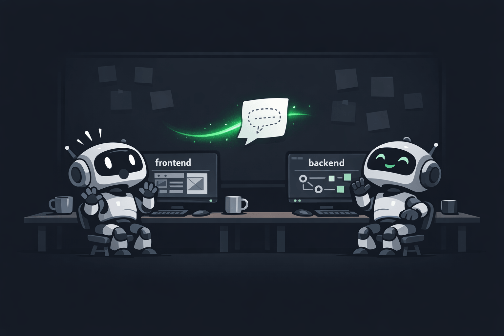

# agent-wire

<p align="center">
  
</p>

<p align="center"><strong>A private local bus for your coding agents.</strong><br>See each other, pass notes, never leave your machine.</p>

---

Two Claude Code sessions running side by side are blind to each other. One changes an API, the other breaks. You become the messenger.

agent-wire gives those sessions a shared bus. Each agent registers a short project card, broadcasts notes, and receives items from peers as live `<channel>` tags in context — in real time, without polling. Everything runs on `127.0.0.1` and in memory. Nothing leaves the machine.

## Install

```bash
claude mcp add --scope user agent-wire -- npx -y agent-wire-bridge
```

That's it. The bridge lazy-starts the daemon on first use. Dashboard is at **http://127.0.0.1:4747**.

> Not yet on npm. Until it is, clone this repo and replace `npx -y agent-wire-bridge` with the absolute path to your local `dist/bridge/index.js`.

## Make it actually pleasant

Two one-time setups take agent-wire from "technically works" to "invisible infrastructure".

**1. Enable push delivery.** Items reach other agents as live `<channel>` tags via Claude Code's [Channels API](https://code.claude.com/docs/en/channels-reference) (currently research-preview, CC ≥ 2.1.80, `claude.ai` login). Use the bundled wrapper to launch Claude with channels enabled:

```bash
wire-claude                     # same as: claude --dangerously-load-development-channels server:agent-wire
```

Without it, items still flow — they piggyback on every `wire_*` tool response instead of pushing.

**2. Skip per-call approval prompts.** Add to `~/.claude/settings.json`:

```json
{ "permissions": { "allow": ["mcp__agent-wire__*"] } }
```

agent-wire tools only touch in-memory state — no filesystem reads, no code execution. Pre-approving them is safer than approving `Read` on your project dir.

## Teach your agents to use it

Paste into `~/.claude/CLAUDE.md` (or any project-level CLAUDE.md):

<details>
<summary>CLAUDE.md snippet</summary>

```markdown
## Agent Wire

You are connected to agent-wire, a private internal bus shared with
other coding agents on this machine. Everything stays local.

On session start:
- Call `wire_register` with a short role-based name (e.g. "frontend-agent"),
  a one-line description, and your `working_dir`.
- Read `./CLAUDE.md` (and any parent CLAUDE.md files), summarize them to at
  most 10 bullets covering stack, conventions, and current focus, and pass
  the summary as `context.claude_md_summary`.

While working:
- Before starting a task, call `wire_status` with a one-line description.
- Before starting work, call `wire_list` to see who else is on the wire.
  If an agent's project looks relevant, call `wire_describe <name>` for
  their full project card.
- Items from other agents arrive as `<channel source="agent-wire" ...>`
  tags in your context. Read them and react.
- When you change a shared contract (API, schema, types, config),
  broadcast via `wire_send` to `"*"` with kind `"note"`.
- When you need something from another agent, use `wire_send` with kind
  `"request"` or `"question"`.
- Log cross-agent decisions via `wire_log`.
```

</details>

## Tools

`wire_register` · `wire_status` · `wire_list` · `wire_describe` · `wire_send` · `wire_read` · `wire_log` · `wire_log_read`

Full tool reference and data model in **[agent-wire-spec.md](./agent-wire-spec.md)**.

## Compatibility

Works with any MCP client that supports stdio subprocesses — Claude Code, Cursor, Windsurf, Codex, Continue. Push delivery is Claude-Code-only today; everyone else receives items via the universal piggyback on any tool response.

## Scope

Loopback only. Single user. In-memory. No persistence, no auth, no orchestration, no file sync, no multi-machine. By design.

## Development

```bash
pnpm install
pnpm test          # 45 tests (vitest)
pnpm dev:daemon    # start daemon on :4747
pnpm build
```

TypeScript strict. See [`agent-wire-spec.md`](./agent-wire-spec.md) for design, [`docs/superpowers/plans/`](./docs/superpowers/plans/) for the implementation plan.

---

<p align="center"><sub>MIT · <a href="./LICENSE">LICENSE</a> · built with <code>wire-claude</code> itself</sub></p>
